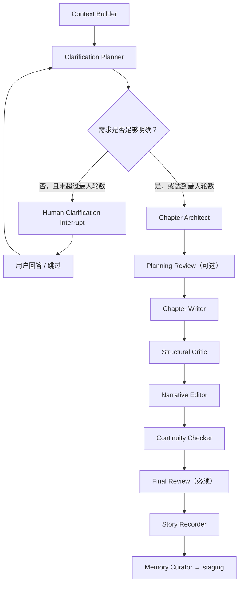

# Clarification Loop 多轮澄清改造技术文档

面向 GLM / Codex 的后续开发文档。

本文件解决一个产品层问题：当前小说 AI 在生成前通常只问一次，甚至直接进入生成；而代码 Agent / Harness 类工具会在需求不完整时反复追问关键细节。小说创作也需要类似能力，但不能让 AI 无限追问、不能破坏现有 Harness 审计链，也不能绕开 Human Review。

## 1. 一句话结论

**等 Expert System v2 的专家模板和 Workflow v2 主链路稳定后，在 `chapter-architect` 前增加一个“多轮澄清环节”。**

实现方式不是推翻现有架构，而是复用：

- `AiRun`
- `AiRunStep`
- `LlmCallLog`
- `HumanInterrupt`
- `workflow_snapshot`
- `expert_snapshot`
- 前端 AgentPanel / Run API

新增：

- `clarification-planner` 专家或 `chapter-architect` 的 preflight 模式
- `ClarificationResult` 结构化输出
- `human_clarification` interrupt 类型
- 前端 `ClarificationPanel` / `ClarificationModal`
- Workflow v2 条件边：需要澄清则问用户，不需要则继续写作链

## 2. 为什么现在只问一次

当前系统的“问用户”主要是最终 Human Review：

```text
生成草稿
→ 一致性检查
→ 人工审核 approve / edit / reject / regenerate
```

这解决的是“生成后是否接受”，不是“生成前需求是否足够清楚”。

代码 Agent 一直追问，是因为它有一个循环：

```text
理解目标
→ 判断缺口
→ 提问
→ 用户回答
→ 再判断
→ 足够清楚后执行
```

小说 AI 当前缺的正是这个 **执行前的需求澄清循环**。

## 3. 改造目标

### 3.1 用户体验目标

当用户点击“章节生成”后：

- 如果本章目标、大纲、视角、人物状态、关键事件已经足够明确，直接生成。
- 如果缺少关键条件，AI 先问 1 到 3 个高价值问题。
- 用户回答后，AI 重新判断是否还需要追问。
- 最多追问 3 轮，避免拖住用户。
- 用户可以跳过澄清，系统按明确的默认假设继续。

### 3.2 工程目标

- 保留现有 Harness 审计链。
- 所有问题和回答必须可追踪、可恢复。
- 不新增独立“聊天系统”。
- 不让 writer 随机向用户提问。
- 不让 LLM 自由调度 workflow。
- 不影响旧专家和旧 workflow 回溯。

## 4. 适用阶段

建议放在 Expert System v2 之后：

| 阶段 | 内容 | 是否依赖 Clarification Loop |
|---|---|---|
| I-1 | v2 字段 + skill 目录 | 否 |
| I-2 | v2 专家模板 + 旧专家 deprecated | 否 |
| I-3 | Workflow Definition + Orchestrator | 否 |
| I-4 | Workflow v2 LangGraph 主链路 | 否 |
| I-5 | 前端切 v2 工作流 | 否 |
| **I-6 / I-7** | **Clarification Loop 多轮澄清** | 是本文目标 |

不建议在 I-4 之前做，因为当前旧 workflow 仍是 writer / critic / consistency 的旧链路，过早接澄清会出现两套交互语义。

## 5. 总体流程

标准章节生成 v2 建议变为：



关键点：

- `Clarification Planner` 只判断缺口和提问，不写正文。
- `Human Clarification Interrupt` 只收集回答，不保存章节版本。
- `Chapter Architect` 收到澄清总结后再输出 `ChapterTaskCard`。
- 最终用户确认仍然通过 `Final Review`。

## 6. 新增专家设计

### 6.1 推荐新增 skill：`clarification-planner`

目录：

```text
backend/skills/clarification-planner/SKILL.md
```

职责：

- 检查章节生成所需输入是否足够。
- 找出会明显影响剧情走向、人物动机、视角、节奏、设定一致性的缺口。
- 生成最多 3 个问题。
- 在用户回答后，整合成 `clarification_summary`。
- 不写正文。
- 不改章节大纲。
- 不替代最终 Human Review。

可选方案：

也可以不新增专家，把该能力作为 `chapter-architect` 的 `preflight` 模式。但长期更建议独立成 `clarification-planner`，因为它的职责不是规划章节，而是判断“是否足够规划”。

### 6.2 SKILL.md 粒度

第一版建议写“框架级 prompt”，不要写太复杂的 few-shot。

必须包含：

- 核心职责
- 必须输入
- 输出 JSON 格式
- 禁止事项
- 权限边界
- 提问策略

禁止事项必须明确：

- 禁止写正文。
- 禁止一次问超过 3 个问题。
- 禁止问不影响生成质量的偏好问题。
- 禁止重复问已经回答过的问题。
- 禁止用“请补充更多信息”这种泛问题。
- 禁止替用户新增大纲里没有的关键剧情事实。

## 7. 结构化输出契约

新增 `ClarificationResult`。

建议文件：

```text
backend/agents/clarification.py
```

### 7.1 ClarificationResult

```json
{
  "needs_clarification": true,
  "confidence": 0.72,
  "missing_fields": ["chapter_goal", "pov", "key_conflict"],
  "questions": [
    {
      "id": "chapter_goal",
      "type": "single_choice",
      "question": "这一章最重要的推进目标是什么？",
      "options": [
        {
          "value": "adapt_to_magic_school",
          "label": "适应魔法高中",
          "description": "重点写主角进入新环境后的震惊、观察和初步适应。"
        },
        {
          "value": "trigger_first_conflict",
          "label": "触发第一次冲突",
          "description": "重点写主角与同学、老师或规则发生明确冲突。"
        }
      ],
      "required": true,
      "reason": "章节目标会决定 writer 的事件选择和节奏。"
    }
  ],
  "assumptions_if_skipped": [
    "默认采用第三人称有限视角。",
    "默认本章以推进主线事件优先，不展开长篇设定说明。"
  ],
  "clarification_summary": ""
}
```

### 7.2 字段说明

| 字段 | 类型 | 说明 |
|---|---|---|
| `needs_clarification` | bool | 是否需要问用户 |
| `confidence` | number | 0 到 1，输入足够程度 |
| `missing_fields` | list[str] | 缺失字段标识 |
| `questions` | list[Question] | 本轮问题，最多 3 个 |
| `assumptions_if_skipped` | list[str] | 用户跳过时采用的默认假设 |
| `clarification_summary` | string | 已有回答的压缩摘要 |

### 7.3 Question

```json
{
  "id": "pov",
  "type": "single_choice",
  "question": "本章采用哪个叙事视角？",
  "options": [
    {"value": "first_person", "label": "第一人称", "description": "更贴近主角心理。"},
    {"value": "third_limited", "label": "第三人称有限", "description": "更适合展示环境和配角反应。"}
  ],
  "required": true,
  "reason": "视角会影响正文口吻和信息披露方式。"
}
```

支持的问题类型：

- `single_choice`
- `multi_choice`
- `free_text`
- `number`

第一版前端可先只完整支持：

- `single_choice`
- `free_text`

其余类型先渲染为文本输入也可接受。

## 8. 提问策略

### 8.1 什么时候必须问

以下缺口会明显影响章节生成质量，应该问：

- 本章目标不明确：不知道本章要推进什么。
- 主角动机不明确：不知道主角为什么行动。
- 关键冲突不明确：不知道戏剧张力来自哪里。
- 视角不明确且已有资料互相冲突。
- 大纲里有多个互斥走向。
- 用户要求“按资料生成”，但资料中包含多个章节大纲，且当前章匹配不清。
- 已确认设定和本章大纲冲突，需要用户裁决。

### 8.2 什么时候不要问

以下情况不要问，直接用合理默认值：

- 字数、文风、节奏有默认设置。
- 只有轻微措辞偏好。
- 可以从当前章节大纲明确推断。
- 不影响剧情结构，只影响局部描写。
- 只是模型想“了解更多背景”。

### 8.3 问题数量限制

- 每轮最多 3 个问题。
- 每个问题必须有 `reason`。
- 最多 3 轮。
- 达到 3 轮后必须继续生成，不能无限 WAITING_HUMAN。

## 9. 状态设计

### 9.1 CreativeState 新增字段

Workflow v2 state 建议新增：

```python
clarification_round: int
max_clarification_rounds: int
clarification_questions: list[dict]
clarification_answers: list[dict]
clarification_summary: str
requirements_complete: bool
clarification_skipped: bool
```

默认值：

```python
clarification_round = 0
max_clarification_rounds = 3
clarification_questions = []
clarification_answers = []
clarification_summary = ""
requirements_complete = False
clarification_skipped = False
```

### 9.2 HumanInterrupt payload

复用现有 `human_interrupts.payload`，不新增表。

建议 payload：

```json
{
  "type": "clarification_questions",
  "workflow_key": "generate_chapter_standard",
  "checkpoint_name": "clarification_review",
  "chapter_id": "uuid",
  "chapter_sequence_number": 2,
  "round": 1,
  "max_rounds": 3,
  "questions": [],
  "assumptions_if_skipped": [],
  "existing_answers": [],
  "clarification_summary": ""
}
```

`step_name`：

```text
human_clarification
```

`AiRunStep.step_name`：

```text
clarification_planner
human_clarification
```

## 10. API 设计

现有接口：

```text
POST /api/ai-runs/{run_id}/human-decisions
```

它适合 final review 的 approve / reject / edit / regenerate，但不太适合结构化问题回答。

### 10.1 推荐新增接口

```text
GET /api/ai-runs/{run_id}/clarification
POST /api/ai-runs/{run_id}/clarification-answers
```

#### GET response

```json
{
  "run_id": "uuid",
  "interrupt_id": "uuid",
  "status": "WAITING",
  "round": 1,
  "max_rounds": 3,
  "questions": [],
  "assumptions_if_skipped": [],
  "existing_answers": [],
  "clarification_summary": ""
}
```

#### POST request

```json
{
  "action": "submit",
  "answers": {
    "chapter_goal": "trigger_first_conflict",
    "pov": "third_limited"
  }
}
```

跳过：

```json
{
  "action": "skip",
  "answers": {}
}
```

#### POST response

```json
{
  "run_id": "uuid",
  "interrupt_id": "uuid",
  "status": "accepted",
  "message": "已记录澄清回答，生成将继续。"
}
```

### 10.2 为什么不直接复用 human-decisions

可以临时复用，但不推荐长期这样做。

原因：

- `HumanDecisionRequest.feedback` 是字符串，不适合结构化 answers。
- `APPROVE/REJECT/EDIT/REGENERATE` 语义是审核生成结果，不是回答问题。
- 澄清回答需要支持多题、多类型、跳过、回合数。

### 10.3 最小兼容方案

如果不想新增 API，可临时：

- `decision=EDIT`
- `feedback=json.dumps({"action": "submit", "answers": {...}})`

但文档建议 GLM 直接做专用 API，避免后续前端和审计语义混乱。

## 11. 枚举是否要改

第一版可以不改数据库枚举，因为当前状态列是字符串。

推荐补充 Python 枚举：

```python
class InterruptDecision(str, Enum):
    APPROVE = "APPROVE"
    REJECT = "REJECT"
    EDIT = "EDIT"
    REGENERATE = "REGENERATE"
    SUBMIT_CLARIFICATION = "SUBMIT_CLARIFICATION"
    SKIP_CLARIFICATION = "SKIP_CLARIFICATION"
```

`InterruptStatus` 可选新增：

```python
ANSWERED = "ANSWERED"
SKIPPED = "SKIPPED"
```

如果担心影响旧逻辑，也可以只把 `HumanInterrupt.status` 继续写为：

- `EDITED`：代表收到回答
- `APPROVED`：代表跳过并接受默认假设

但从可读性看，新增 `ANSWERED/SKIPPED` 更好。

## 12. Workflow Definition 改造

当前 `generate_chapter_standard`：

```text
chapter_architect
planning_review
chapter_writer
structural_critic
narrative_editor
continuity_checker
final_review
```

建议改为：

```text
context_builder
clarification_planner
human_clarification?   # 条件节点，可循环
chapter_architect
planning_review?
chapter_writer
structural_critic
narrative_editor
continuity_checker
final_review
story_recorder
memory_curator
```

`workflow_snapshot` 必须记录：

- `clarification_planner`
- `human_clarification`
- `max_clarification_rounds`
- 条件边策略

示例：

```json
{
  "node_key": "clarification_planner",
  "expert_key": "clarification-planner",
  "step_order": 2,
  "conditional": true,
  "routes": {
    "needs_clarification": "human_clarification",
    "ready": "chapter_architect"
  }
}
```

## 13. LangGraph 节点设计

### 13.1 `clarification_planner_node`

输入：

- 当前章节标题
- 当前章节大纲
- 用户选择的素材
- 已确认记忆
- 角色 / 世界观 / 事件 / 伏笔
- 历史回答

输出：

- `clarification_result`
- `requirements_complete`
- `clarification_questions`
- `clarification_summary`

伪代码：

```python
async def clarification_planner_node(state: CreativeState) -> dict:
    result = await run_clarification_planner(...)
    needs = result["needs_clarification"]
    can_ask_more = state["clarification_round"] < state["max_clarification_rounds"]

    return {
        "clarification_result": result,
        "clarification_questions": result.get("questions", []),
        "clarification_summary": result.get("clarification_summary", ""),
        "requirements_complete": not needs or not can_ask_more,
    }
```

### 13.2 条件路由

```python
def route_after_clarification(state: CreativeState) -> str:
    if state.get("requirements_complete"):
        return "chapter_architect"
    if state.get("clarification_skipped"):
        return "chapter_architect"
    if state.get("clarification_round", 0) >= state.get("max_clarification_rounds", 3):
        return "chapter_architect"
    return "human_clarification"
```

### 13.3 `human_clarification_node`

职责：

- 创建 `HumanInterrupt`
- run status → `WAITING_HUMAN`
- step status → `WAITING_HUMAN`
- SSE 发 `clarification_required`
- 暂停 workflow

它不调用 LLM。

### 13.4 resume 后继续

用户提交答案后：

```text
POST /api/ai-runs/{run_id}/clarification-answers
→ resolve interrupt
→ append clarification_answers
→ clarification_round += 1
→ workflow 从 clarification_planner 继续
```

不是直接跳到 writer。

## 14. Harness 记录规则

### 14.1 AiRunStep

建议 step：

| step_name | node_key | expert_key | step_order |
|---|---|---|---|
| `build_context` | `context_builder` | null | 1 |
| `clarification_planner` | `clarification_planner` | `clarification-planner` | 2 |
| `human_clarification` | `human_clarification` | null | 3 |
| `chapter_architect` | `chapter_architect` | `chapter-architect` | 4 |
| `planning_review` | `planning_review` | null | 5 |
| `chapter_writer` | `chapter_writer` | `chapter-writer` | 6 |

多轮澄清时，`idempotency_key` 建议：

```text
{run_id}:clarification_planner:{round}
{run_id}:human_clarification:{round}
```

### 14.2 LlmCallLog

`clarification_planner` 的 LLM 调用必须记录：

- `run_id`
- `step_id`
- `agent_name = clarification_planner`
- `rendered_prompt_snapshot`
- `context_package_snapshot`
- `request` JSON 中补：

```json
{
  "workflow_key": "generate_chapter_standard",
  "expert_key": "clarification-planner",
  "expert_version": 1,
  "skill_dir": "clarification-planner",
  "clarification_round": 1
}
```

不需要给 `llm_call_logs` 加列。

## 15. SSE 事件

新增事件：

```text
clarification_required
clarification_answered
clarification_skipped
```

### 15.1 `clarification_required`

```json
{
  "run_id": "uuid",
  "interrupt_id": "uuid",
  "thread_id": "langgraph-thread",
  "round": 1,
  "max_rounds": 3,
  "questions": [],
  "assumptions_if_skipped": []
}
```

### 15.2 前端类型

需要更新：

```text
frontend/src/api/types.ts
```

把新事件加入 `SSEEventType` union。

## 16. 前端设计

### 16.1 新组件

```text
frontend/src/components/ClarificationPanel.vue
```

或：

```text
frontend/src/components/ClarificationModal.vue
```

推荐 Panel，因为它和 AgentPanel 的运行过程更一致。

### 16.2 UI 行为

当收到 `clarification_required`：

- AgentPanel 展示问题列表。
- 每个问题根据 `type` 渲染控件。
- 用户可以提交回答。
- 用户可以点击“跳过，使用默认假设”。
- 提交后按钮进入 loading。
- 后端恢复 workflow 后继续流式展示。

### 16.3 不要做成普通聊天框

不要让用户随意输入一长段“你再想想”。

澄清问题应该是结构化任务表单，原因：

- 容易持久化。
- 容易恢复。
- 容易写测试。
- 不会把最终审核和生成前澄清混在一起。

## 17. 与 ChapterTaskCard 的关系

`ClarificationResult` 不替代 `ChapterTaskCard`。

它只是给 `chapter-architect` 补足输入。

推荐数据流：

```text
用户目标 + 大纲 + 上下文
→ ClarificationResult
→ clarification_summary
→ ChapterTaskCard
→ chapter-writer
```

`ChapterTaskCard` 应包含：

```json
{
  "clarification_summary": "用户确认本章以触发第一次冲突为主，采用第三人称有限视角。"
}
```

## 18. 与 Human Review 的边界

Clarification Loop 是“生成前确认”。

Human Review 是“生成后确认”。

不要合并。

| 环节 | 目的 | 用户动作 | 是否保存版本 |
|---|---|---|---|
| Clarification Loop | 补齐需求 | 回答 / 跳过 | 否 |
| Planning Review | 审章节任务卡 | 通过 / 修改 / 跳过 | 否 |
| Final Review | 审最终正文 | approve / edit / reject | 是 |

## 19. 与记忆系统的边界

Clarification Loop 的回答默认不直接进入正式记忆库。

原因：

- 用户回答可能只是本次生成偏好。
- 不一定是作品事实。
- 需要正文确认后才进入 staging。

如果某个回答是明确设定，例如“主角不能使用火系魔法”，也不要在澄清阶段直接写正式表。

正确链路：

```text
澄清回答
→ 影响本章生成
→ 用户 approve 正文
→ FactExtractionAgent 抽取
→ writing_memory_staging
→ 用户确认
→ 正式记忆库
```

## 20. 测试计划

### 20.1 单元测试

新增：

```text
backend/tests/test_clarification.py
```

覆盖：

- `parse_clarification_result` 可解析纯 JSON。
- 可从散文中提取 JSON。
- JSON 失败返回 fallback。
- 问题超过 3 个时裁剪。
- 问题缺 id 时自动生成稳定 id。
- `needs_clarification=false` 时不产生问题。
- 已回答问题不会重复问。

### 20.2 Workflow 测试

新增：

```text
backend/tests/test_workflow_v2_clarification.py
```

覆盖：

- 输入足够明确 → 不触发 interrupt。
- 输入缺章节目标 → 创建 HumanInterrupt。
- 用户提交答案 → 回到 `clarification_planner`。
- 最多 3 轮后继续 `chapter_architect`。
- skip 后继续 `chapter_architect`。
- run / step / interrupt 状态正确。

### 20.3 API 测试

覆盖：

- `GET /api/ai-runs/{run_id}/clarification`
- `POST /api/ai-runs/{run_id}/clarification-answers`
- 跨用户 404
- 非 WAITING 状态提交 409
- 重复提交幂等
- skip 写入 assumptions

### 20.4 前端测试

覆盖：

- 收到 `clarification_required` 后展示问题。
- `single_choice` 可选择。
- `free_text` 可输入。
- submit 调 API。
- skip 调 API。
- loading / error 状态。

## 21. 验收标准

### 21.1 功能验收

- 章节信息足够时，直接生成，不打扰用户。
- 章节信息不足时，最多提出 3 个高价值问题。
- 用户回答后，系统能继续追问或进入生成。
- 最多 3 轮，不会无限等待。
- 用户跳过后，系统使用默认假设继续。
- 生成后仍走 final review，不绕过用户确认。

### 21.2 审计验收

- 每轮澄清都有 `AiRunStep`。
- 每次 LLM 判断都有 `LlmCallLog`。
- 每次等待用户都有 `HumanInterrupt`。
- interrupt payload 里能看到问题、回答、轮次。
- run 状态能从 `WAITING_HUMAN` 恢复到 `RUNNING/COMPLETED`。

### 21.3 兼容验收

- 不影响旧专家 deprecated 链路。
- 不影响旧 run 查询。
- 不改 `llm_provider.py`。
- 不新增独立记忆系统。
- 不让 writer 自己随意 interrupt。

## 22. 分阶段执行建议

### Phase J-1：文档与 Skill

- 新增 `clarification-planner/SKILL.md`
- 新增 `ClarificationResult` schema 文档
- 更新 `workflow_definitions.py`
- 不接 LangGraph

验收：

- skill 可扫描
- workflow snapshot 可序列化
- 测试通过

### Phase J-2：解析器与 Planner Agent

- 新增 `backend/agents/clarification.py`
- 实现 `parse_clarification_result`
- 实现 `run_clarification_planner`
- 接入 `LoggedLLMProvider`

验收：

- parser 单测通过
- LLM call log 有 prompt snapshot

### Phase J-3：HumanInterrupt API

- 新增 clarification 查询 / 提交 API
- payload 存 questions / answers / round
- 支持 submit / skip
- 支持跨用户 404 和幂等

验收：

- API 测试通过
- 旧 `human-decisions` 不受影响

### Phase J-4：Workflow v2 接入

- 在 v2 full_pipeline 中加入 `clarification_planner_node`
- 加条件边和循环
- run/step 状态接入 Harness

验收：

- 缺信息触发等待
- 回答后继续
- 最多 3 轮

### Phase J-5：前端 UI

- 新增 `ClarificationPanel.vue`
- AgentPanel 接收新 SSE
- client/types 加 API
- 支持 submit / skip

验收：

- vue-tsc 通过
- vitest 通过
- 手动生成可完成澄清流程

## 23. GLM 执行注意事项

1. 不要在旧 `workflow.py` 上强行插入澄清逻辑，除非 I-4 已经明确切到 workflow_v2。
2. 不要让 `chapter-writer` 自己问用户；提问只能由 `clarification-planner` 发起。
3. 不要把澄清回答直接写正式记忆库。
4. 不要新增文件型记忆系统。
5. 不要把澄清问题做成自由聊天。
6. 不要一次问超过 3 个问题。
7. 不要无限循环，最多 3 轮。
8. 不要修改 `llm_provider.py`，继续用 wrapper 记录。
9. 不要给 `llm_call_logs` 加新列，运行时元信息写入 `request` JSON。
10. 不要破坏旧专家 deprecated 的可回溯性。

## 24. 最小成功版本

最小版本只需要做到：

```text
章节生成前
→ clarification-planner 判断是否缺关键输入
→ 缺则问最多 3 个问题
→ 用户回答
→ 整理 clarification_summary
→ chapter-architect 使用 summary 生成 ChapterTaskCard
→ 后续链路照旧
```

暂时不做：

- 自由拖拽流程图
- 多专家自动协商
- 联网考据
- 把澄清回答直接入库
- 每个问题复杂条件显隐

## 25. 对当前问题的直接解释

“为什么 coding agent 会一直问，而小说 AI 只问一次？”

因为 coding agent 的执行模型里天然有一个 **需求缺口判断 → 提问 → 回答 → 再判断** 的循环；当前小说 AI 的 Human Review 是 **生成后审核**，不是 **生成前澄清**。要达到同样体验，需要把这个循环显式建进 Workflow v2，而不是只改 prompt。

这也是本文建议新增 `clarification-planner` 和 `human_clarification` 条件循环的原因。
